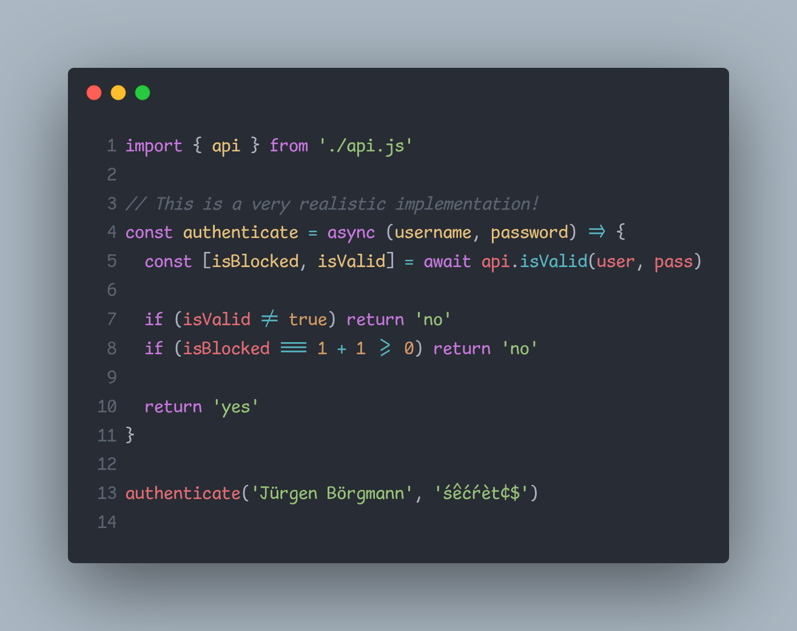

# Komisch Mono

[Comic Mono](https://github.com/dtinth/comic-mono-font) fork using
[Comic Shanns v2](https://github.com/shannpersand/comic-shanns) as base with [ligatures](https://github.com/ToxicFrog/Ligaturizer), umlauts, diacritics and most [Nerdfont symbols](https://github.com/ryanoasis/nerd-fonts/).

## Preview



## Rebuild

> Requires Nix.

```sh
nix build
# Fonts are inside `./result`.
```

## License and Attributions

This project is released under the MIT license.
Check out the [LICENSE](LICENSE) file for more information.

[Neo Comic Mono](https://github.com/jptrzy/neo-comic-mono-font) was used as reference for the nix file.
