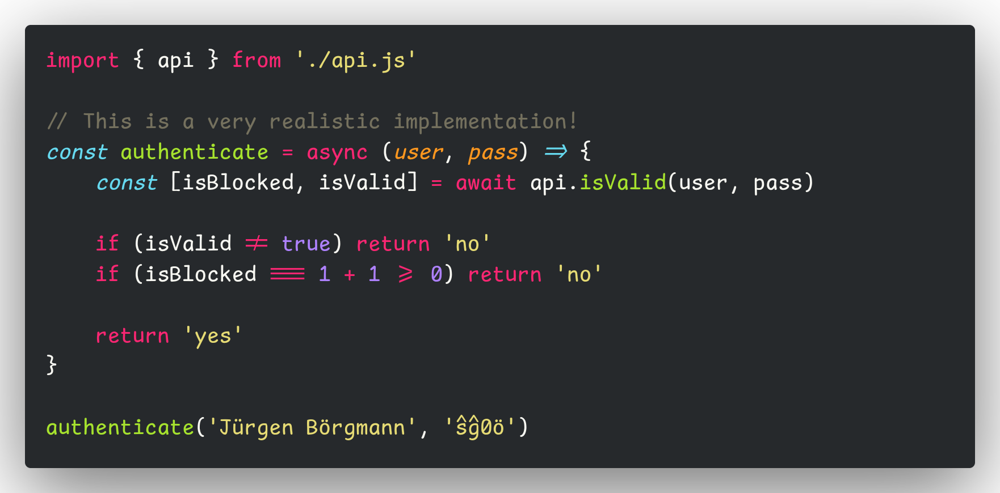

# Komiki Mono

[Comic Mono](https://github.com/dtinth/comic-mono-font) fork using
[Comic Shanns v2](https://github.com/shannpersand/comic-shanns) as base with 
[ligatures](https://github.com/ToxicFrog/Ligaturizer).

The font family is called `Komiki Mono`.

## Download

- [KomikiMono-Regular.otf](https://github.com/salif/komiki-mono/releases/download/v1.2024.812/KomikiMono-Regular.otf)
- [KomikiMono-Bold.otf](https://github.com/salif/komiki-mono/releases/download/v1.2024.812/KomikiMono-Bold.otf)
- [KomikiMonoZero-Regular.otf](https://github.com/salif/komiki-mono/releases/download/v1.2024.812/KomikiMonoZero-Regular.otf)

## Preview



## Development

Requires `just` and `ligaturizer`.

```sh
just --set ligature_font_file \
    /usr/share/fonts/OTF/FiraCode-Regular.otf build
```

Fonts are inside `./output`.

## License and Attributions

This project is released under the MIT license.
Check out the [LICENSE](LICENSE) file for more information.

[Komisch Mono](https://github.com/marcelhas/komisch-mono-font) was used as reference.
